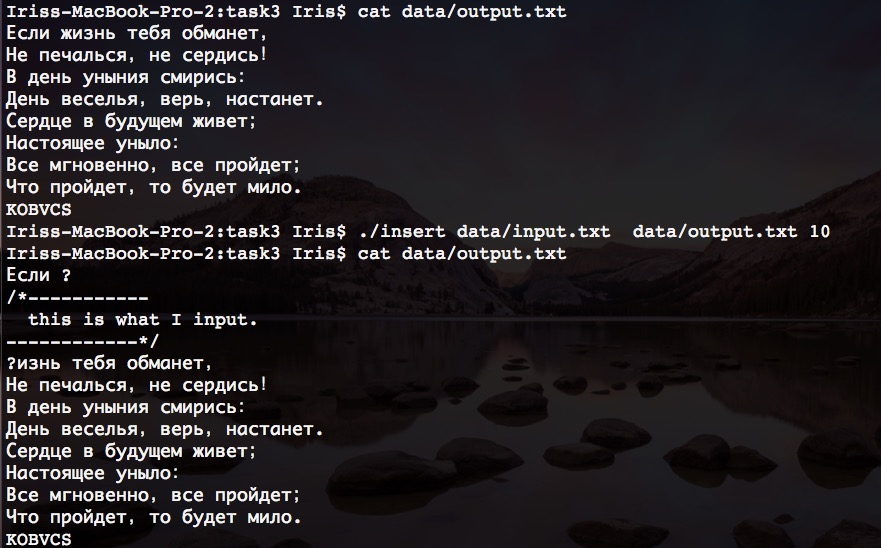

#Linux Assignment 1
######__陈璐 1253036 o0lazybear0o@gmail.com__
---

###Task 1

#####Description
实现ls功能

+ 支持不带参数
+ 带有参数-l的两种形式

#####Upload
+ src: [task1/ls.cpp](./task1/ls.cpp)
+ bin: [task1/ls](task1/ls)

#####Function

+ 无参数默认路径为当前路径
+ 支持 -l 功能
+ 支持多路径目录
+ 增加 -h help 功能

####Demo
+ __ls__


+ __ls -l__


+ __ls -l dir__


+ __ls -h__


###Task 2
####Description
什么是符号链接和硬连接？试比较两者异同

####Answer
######符号链接

符号链接（软链接）：软链接是一个完整的文件，而这个文件中存放的是它自己的inode号和真实的那个源文件的路径。作用在这个文件上的操作除了删除都直接转向实际指向文件，由于它是一个真实的文件所以占用磁盘空间。

######硬链接

由于linux下的文件是通过索引节点（Inode）来识别文件，硬链接可以认为是一个指针，指向文件索引节点的指针，系统并不为它重新分配inode。

######相同之处

+ 都是一种在共享文件和访问它的用户的若干目录项之间建立联系的一种方法。
+ 无论是硬链接文件还是符号链接文件还是原文件，更改任意一个文件都会使与它相链接的文件发生相同的改变。

######不同
+ 硬链接指向的是节点(inode),而符号链接指向的是路径(path)。
+ 硬链接不能给目录创建，并且只能在同一文件系统中的文件之间才能创建，符号链接没有这两条限制。
+ 创建硬链接后文件的链接数加1，创建符号链接文件链接数不变。
+ 在原文件被删除后，符号链接变得不可用，硬链接没有任何影响。
+ 硬链接文件与原文件拥有同一个inode号，符号链接文件与原文件的inode号不相同。
+ 在文件属性中，符号链接文件被标明是链接文件，而硬链接文件与原文件有相同的地位，不会被标明。
+ 硬链接与原文件大小相同，符号链接不同

###Task3
####Description
写一个程序，向一个文本中插入一段内容

####Upload
+ __src__: _[task3/insert.c](task3/insert.c)_
+ __bin__: _[task3/insert](task3/insert)_
+ __data__: _[task3/data/input.txt](task3/data/input.txt)_ _[task3/data/input.txt](task3/data/input.txt)_

####Instruction

__需要传递三个参数__

```
1. inputfile Path 必需存在
2. outputfile Path 如不存在会被创建
3. insert Position 大于目标文件大小，插入到文件末尾；小于0，插入到文件开头
```

####Demo
